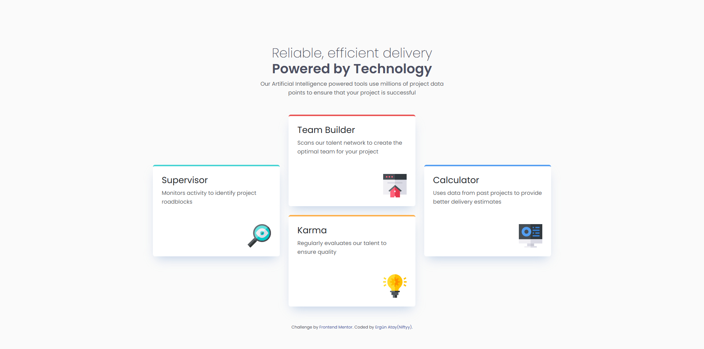

# Frontend Mentor - Four Card Feature Section Solution

This is my solution to the [Four Card Feature Section challenge on Frontend Mentor](https://www.frontendmentor.io/challenges/four-card-feature-section-weK1eFYK).

Frontend Mentor challenges help me improve my HTML and CSS skills by building realistic projects.

## Overview

### The Challenge

Users should be able to:

- View the optimal layout for the site depending on their device's screen size.
- Experience a responsive layout on both desktop and mobile devices.

### Screenshot

### Links

- Solution URL: [View my solution](https://github.com/ErgunAtay/four-card-feature-section-master)
- Frontend Mentor Profile: [@ErgunAtay](https://www.frontendmentor.io/profile/ErgunAtay)
- Live Site URL: [View live site](https://ergunatay.github.io/four-card-feature-section-master/)

## My Process

### Built With

- Semantic HTML5 markup
- CSS
- Bootstrap 5.3
- Flexbox
- Responsive design
- Mobile and desktop layouts

### What I Learned

During this project, I practiced building a responsive layout using HTML, CSS, and Bootstrap.

Some of the concepts I worked on include:

- Using Bootstrap grid and utility classes.
- Creating layouts that adapt to different screen sizes.
- Combining Bootstrap classes with custom CSS.
- Structuring a page using semantic HTML elements.
- Improving my understanding of spacing, alignment, and responsive design.

This project helped me gain more experience with Bootstrap and responsive web development.

### Continued Development

In future projects, I want to continue improving my:

- HTML and CSS skills.
- Responsive design knowledge.
- Bootstrap usage.
- Understanding of Flexbox and CSS Grid.
- Ability to build projects with less assistance.

## AI Collaboration

I used ChatGPT during this project to:

- Understand HTML and CSS concepts.
- Get help with debugging and understanding code.
- Ask questions about Bootstrap classes and responsive layouts.

I used AI as a learning aid while working on the project and improving my understanding of the concepts.

## Author

- GitHub: [@ErgunAtay](https://github.com/ErgunAtay)
- Frontend Mentor: [@ErgunAtay](https://www.frontendmentor.io/profile/ErgunAtay)

## Acknowledgments

- [Frontend Mentor](https://www.frontendmentor.io/) - For providing the challenge and design.
- [Bootstrap](https://getbootstrap.com/) - For the CSS framework and utility classes.
